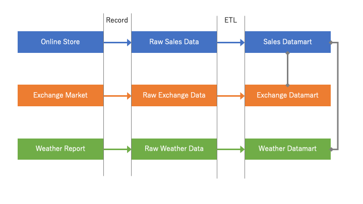
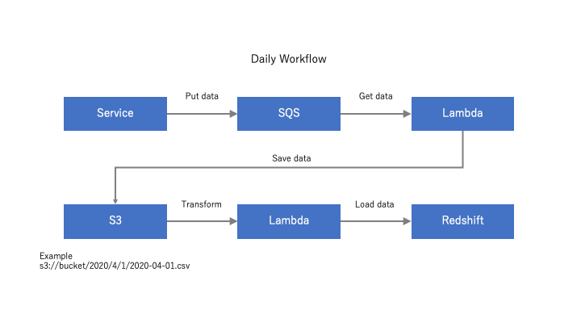

# Document for Capstone Project of Data Engineer Nano Degree

This document describes the data model of my capstone project and the process of its ETL.

# Purpose

The sales data of online retail store is used here.
This is because online stores are getting more and more popular thesedays, and hence it is important to analyze their data for their growth.
Possible analyses are the amount of sales per day, the total sold price per item, and the total sold price per customer.

# Data

Three data are included. One is the sales data of online retail store which is based on United Kingdom. Customers are not only in U.K. but also in other places such as France. Therefore, the exchange rate between GBP and USD is incorporated in database to investigate the effect of exchange rate on retail sales. The weather data in London is also included because online shopping would be affected by weather.

1. `online_retail_II.csv`: The sales data of a online retail store is obtained from [UCI Machine Learning Repository](https://archive.ics.uci.edu/ml/datasets/Online+Retail+II). This data contains 1,067,371 rows and 8 columns.
1. `GBP_USD_Historical_Data.csv`: The exchange price data between GBP and USD comes from [Investing.com](https://www.investing.com/). This include 782 rows and 6 columns.
1. `London_weather_N.json`: The weather information in London is aquired from [OpenWeather](https://openweathermap.org/).
    - The original file consists of 26,280 rows and 19 columns and its size is about 9MB.
    - Redshift does not accept to read more than 4MB JSON file ([link](https://forums.aws.amazon.com/thread.jspa?threadID=216796)).
    - Therefore it is splited into three files.

# Data model

Here data model is assumed as below.
There are three services, the online store, the exchange market, and the weather report.
Each service produces their raw data, and these raw data have to be processed for datamart as describe here.



Star schema is adopted here, because just three kinds of data exist and joining them is not so intensive.
A simple model should be more useful than sophisticated ones in this situation.

# Tables

Three tables created are explained here.
All the data are sorts of timeseries data, so they can be combined with their date or timestamp columns.

## Fact Table
**retail**
|invoice|stockcode|description|quantity|invoicedate|price|customerid|country|
|-|-|-|-|-|-|-|-|
|text not null|text|text|int|timestamp not null|float|int|text|

## Dimension Table
**rate**

|date|usd|open|high|low|pct_change|
|-|-|-|-|-|-|
|date not null|float not null|float|float|float|float|

**weather**
|city|latitude|longitude|temperature|temperature_min|temperature_max|feel_like|pressure|humidity|wind_speed|wind_degree|clouds|weather|description|dt|dt_iso|timezone|
|-|-|-|-|-|-|-|-|-|-|-|-|-|-|-|-|-|
|text not null|float|float|float not null|float|float|float|float|float|float|float|text|text not null|text|bigint not null|timestamp not null|int|

# ETL Tools and Processes

Raw data are stored in Amazon S3 and Data Warehouse is Amazon Redshift.
This is because both are scalable for the increase of data size, and they are integrated to each other well.
This make it easy to load data into Data Warehouse from storage and to analyize data seemlessly.

## ETL scripts

Here, scripts for ETL are introduced.

- `etl.py` does the actual ETL processes. Main steps are
  1. Create tables
  1. Load raw data into staging tables
  1. Insert relevant data from staging tables into datamart
  1. Validate data and check the numbers of rows, distinct values, etc
- `queries.py` denotes queries to create tables and load data into them. These queries are imported by `etl.py`.
- `params.cfg` contains values necessary for such as data retrieval and connection to Redshift.

### Directory of Source Codes

The source codes for this project has the structure of directory as below.
Main ETL scripts are in `src` directory.
`README.md` and `images` directory is for this documentation.
GitHub repository is [here](https://github.com/ieiriyuki/ud_data_engineer).

```bash
capstone
  ├src
  |  ├etl.py
  |  └queries.py
  ├images
  |  └datamodel.png
  ├params.cfg
  └README.md
```

### S3 Bucket structure

This section shows the structure of S3 Bucket used in this project.
Most objects are directly under the bucket except weather data.
Weather data is seperated into three files for size limitation of Redshift and located in `weather` directory.
In addition, jsonpath file, `weather_json_path.json`, is used to parse weather data.

```bash
bucket
  ├online_retail_II.csv
  ├GBP_USD_Historical_Data.csv
  ├weather
  |  ├London_weather_0.json
  |  ├London_weather_1.json
  |  └London_weather_2.json
  └weather_json_path.json
```

# Future Work

In this document, my data model for online retail store is described.
As the store grows, data will be accumulated and many analysts will access the database.
Here, some plans are explained to adjust such situations.

## Case 1: Increase of data size
At this moment, all data are past historical data between January 2009 and December 2011, and the size it not so huge.
Therefore, the processes here is like an one-time batch process.
If data become 100 times larger than it is now, possible approaches are

- Seperate data based on the sales date and load them daily
- Use [Amazon DynamoDB](https://aws.amazon.com/dynamodb/), which is fast NoSQL databse for intensive read and write, and load data immediately upon an arrival so that ETL processes can deal with small amount of data

## Case 2: Daily processing of data
The current ETL processes are designed to execute one-time batch processing.
If I have to run processing daily such as every 7 am, available solutions are

- Use cloud computing services like [AWS Lambda](https://aws.amazon.com/lambda/), [AWS Batch](https://aws.amazon.com/batch/), and [AWS Data Pipeline](https://aws.amazon.com/datapipeline/).
  - These services support scheduled execution of data processing, and computing resources are managed by Amazon Web Services. Therefore, focuses are on developing data processing rather than platform construction.
- If it is necessary for data engineer to conrtol of job scheduling in detail, [Apache Airflow](https://airflow.apache.org/) mey be a good option. There, job scheduling and task dependency can be programed at high level.

An example of daily processing is like below.



## Case 3: Intensive access by many users
At present, it is assumed that only limited people use this database for analyses.
However, it should be planned what can be taken so that many users can access to the database.

- One can modify some [configurations](https://aws.amazon.com/redshift/pricing/) of Redshift cluster, such as
  - A suitable node type is chosen depending on requirements of storage and cpu usages
  - The more nodes give the better performance
  - [Concurrency scaling](https://docs.aws.amazon.com/redshift/latest/dg/concurrency-scaling.html) enables many concurrent access and queries
- Apart from Redshift, [Amazon DynamoDB](https://aws.amazon.com/dynamodb/]) could be an option if a particular type of query is frequently executed.
  - DynamoDB is a managed NoSQL database like Apache Cassandra.
  - Design tables in DynamoDB so that a particular query can get its immediate result.
